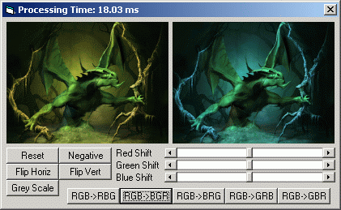



## Picture Processing Using GetBitmapBits and SetBitmapBits

### Description

Super fast picture processing using GetBitmapBits and SetBitmapBits. Tons of comments for all you coders to learn these 2 APIs. Compatible with 24 and 32 bit color with 8 and 16 bit comming soon. Program will copy from one picture to another with these techniques: straight copy, negative, flip horizontally, flip vertically, grey scale, red color shift, green color shift, blue color shift and 5 different RGB swap routines. All of this in only 310 lines of code and half of those are code comments! Please note that some of these copy techniques have faster counterparts using other APIs, but many of these can only be faster using CopyMemory or embedded ASM code, both of which are a pain in the arse ;) Enjoy!
 
### More Info
 

             |
---                |---
**Submitted On**   |2002-08-08 12:34:58
**By**             |[¿?¿?](https://github.com/Planet-Source-Code/PSCIndex/blob/master/ByAuthor/empty.md)
**Level**          |Advanced
**User Rating**    |3.9 (35 globes from 9 users)
**Compatibility**  |VB 6\.0
**Category**       |[Graphics](https://github.com/Planet-Source-Code/PSCIndex/blob/master/ByCategory/graphics__1-46.md)
**World**          |[Visual Basic](https://github.com/Planet-Source-Code/PSCIndex/blob/master/ByWorld/visual-basic.md)
**Archive File**   |[Picture\_Pr115832882002\.zip](https://github.com/Planet-Source-Code/picture-processing-using-getbitmapbits-and-setbitmapbits__1-37738/archive/master.zip)

